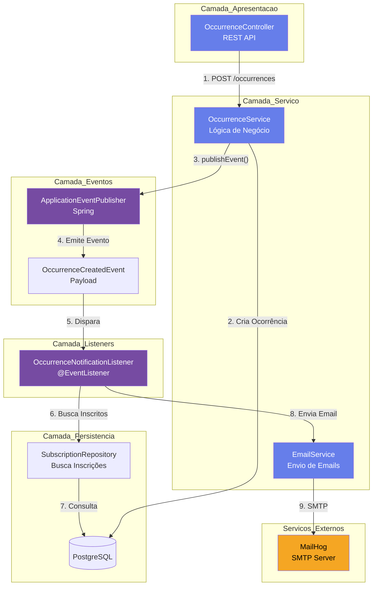
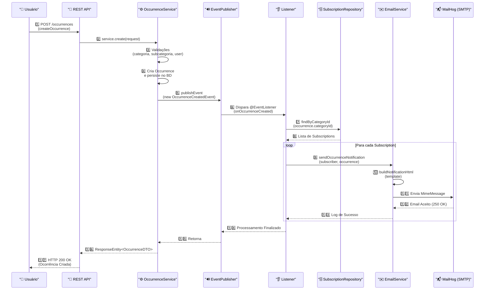
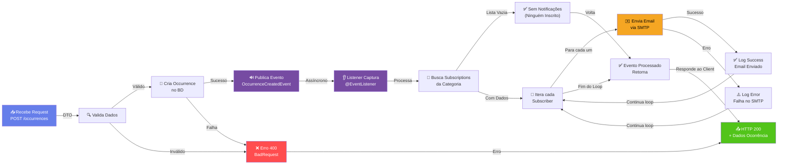
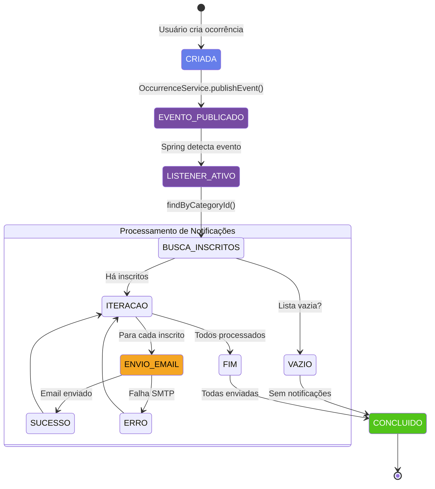

# Documentação do Fluxo de Publicação de Eventos - Talkie

## 📋 Sumário Executivo

O sistema **Talkie** implementa um padrão **Pub/Sub (Publicador/Assinante)** baseado em eventos do Spring Framework para desacoplar a criação de ocorrências do envio de notificações por email. Quando uma nova ocorrência é criada, um evento é publicado e capturado por um listener que notifica automaticamente todos os usuários inscritos na categoria correspondente.

---

## 🏗️ Arquitetura do Sistema de Eventos



---

## 🔄 Diagrama de Sequência Completo



---

## 📊 Fluxo de Processamento Passo a Passo



---

## 🎯 Componentes Principais

### 1️⃣ OccurrenceService (Publicador do Evento)

**Localização:** `src/main/java/com/tcc/talkie/service/OccurrenceService.java`

**Responsabilidade:** Publicar o evento após a criação bem-sucedida de uma ocorrência.

```java
@Service
@RequiredArgsConstructor
public class OccurrenceService {
    
    private final OccurrenceRepository occurrenceRepository;
    private final ApplicationEventPublisher eventPublisher;  // ← Publica eventos
    
    public OccurrenceResponseDTO create(OccurrenceRequestDTO request) {
        // 1. Validações
        // 2. Criar Occurrence
        
        Occurrence occurrence = new Occurrence();
        occurrence.setTitle(request.title());
        occurrence.setDescription(request.description());
        occurrence.setLocation(request.location());
        occurrence.setOwner(AuthenticatedUser.get());
        occurrence.setCategory(category);
        occurrence.setSubcategory(subcategory);
        
        // 3. Persistir
        Occurrence saved = occurrenceRepository.save(occurrence);
        
        // 4. 🔊 PUBLICAR EVENTO
        eventPublisher.publishEvent(new OccurrenceCreatedEvent(saved));
        
        return mapToResponse(saved);
    }
}
```

---

### 2️⃣ OccurrenceCreatedEvent (Payload do Evento)

**Localização:** `src/main/java/com/tcc/talkie/events/OccurrenceCreatedEvent.java`

**Responsabilidade:** Encapsular os dados da ocorrência criada para serem passados ao listener.

```java
public class OccurrenceCreatedEvent {
    
    private final Occurrence occurrence;
    
    public OccurrenceCreatedEvent(Occurrence occurrence) {
        this.occurrence = occurrence;
    }
    
    public Occurrence getOccurrence() {
        return occurrence;
    }
}
```

---

### 3️⃣ OccurrenceNotificationListener (Assinante do Evento)

**Localização:** `src/main/java/com/tcc/talkie/listeners/OccurrenceNotificationListener.java`

**Responsabilidade:** Escutar eventos de ocorrência criada e coordenar o envio de emails.

```java
@Slf4j
@Component
@RequiredArgsConstructor
public class OccurrenceNotificationListener {
    
    private final SubscriptionRepository subscriptionRepository;
    private final EmailService emailService;
    
    @EventListener
    public void onOccurrenceCreated(OccurrenceCreatedEvent event) {
        var occurrence = event.getOccurrence();
        
        // 1. Buscar todas as inscrições para essa categoria
        var subscribers = subscriptionRepository.findByCategoryId(
            occurrence.getCategory().getId()
        );
        
        // 2. Para cada inscrito, enviar notificação
        subscribers.forEach(sub -> {
            log.info("Enviando notificação para {} ({}) sobre ocorrência '{}'",
                sub.getSubscriber().getName(),
                sub.getSubscriber().getEmail(),
                occurrence.getTitle()
            );
            
            emailService.sendOccurrenceNotification(
                sub.getSubscriber(),
                occurrence
            );
        });
    }
}
```

---

### 4️⃣ EmailService (Serviço de Notificação)

**Localização:** `src/main/java/com/tcc/talkie/service/EmailService.java`

**Responsabilidade:** Construir e enviar emails formatados via SMTP.

```java
@Slf4j
@Service
@RequiredArgsConstructor
public class EmailService {
    
    private final JavaMailSender mailSender;
    
    public void sendOccurrenceNotification(User subscriber, Occurrence occurrence) {
        try {
            MimeMessage message = mailSender.createMimeMessage();
            MimeMessageHelper helper = new MimeMessageHelper(message, true, "UTF-8");
            
            // 1. Construir conteúdo HTML
            String subject = String.format("Nova ocorrência em %s", 
                occurrence.getCategory().getName());
            String htmlContent = buildNotificationHtml(subscriber, occurrence);
            
            // 2. Configurar email
            helper.setFrom(mailFrom, mailFromName);
            helper.setTo(subscriber.getEmail());
            helper.setSubject(subject);
            helper.setText(htmlContent, true);
            
            // 3. Enviar via SMTP
            mailSender.send(message);
            
            log.info("Email enviado com sucesso para {} ({})",
                subscriber.getName(),
                subscriber.getEmail()
            );
        } catch (MessagingException e) {
            log.error("Erro ao enviar email para {}: {}",
                subscriber.getEmail(),
                e.getMessage(),
                e
            );
        }
    }
    
    private String buildNotificationHtml(User subscriber, Occurrence occurrence) {
        return String.format("""
            <!DOCTYPE html>
            <html>
            ...
            Olá <strong>%s</strong>,
            Uma nova ocorrência foi reportada em %s!
            ...
            """,
            subscriber.getName(),
            occurrence.getCategory().getName()
        );
    }
}
```

---

### 5️⃣ SubscriptionRepository (Acesso aos Dados)

**Localização:** `src/main/java/com/tcc/talkie/repository/SubscriptionRepository.java`

**Responsabilidade:** Buscar todas as inscrições para uma categoria específica.

```java
@Repository
public interface SubscriptionRepository extends JpaRepository<Subscription, Long> {
    
    // Busca inscrições por categoria (usada no listener)
    List<Subscription> findByCategoryId(Long categoryId);
    
    // Outras operações
    List<Subscription> findBySubscriberId(UUID subscriberId);
    Optional<Subscription> findBySubscriberIdAndCategoryId(UUID subscriberId, Long categoryId);
    boolean existsBySubscriberIdAndCategoryId(UUID subscriberId, Long categoryId);
}
```

---

## 📧 Fluxo de Email

```mermaid
graph LR
    A["📧 Construct<br/>MimeMessage"] -->|UTF-8| B["🎨 Build HTML<br/>Template"]
    
    B -->|Subject| C["📝 Configure Email<br/>(From, To, Subject)"]
    
    C -->|HTML Content| D["🔐 Set Body<br/>(Text Mode)"]
    
    D -->|Complete| E["📤 Send via<br/>JavaMailSender"]
    
    E -->|TCP 1025| F["📬 MailHog SMTP<br/>Server"]
    
    F -->|Accept (250)| G["✅ Success Log"]
    F -->|Error| H["❌ Error Log"]
    
    G -->|Salva| I["💾 MailHog<br/>Database"]
    I -->|Visualizar em| J["🌐 http://localhost:8025"]
    
    style A fill:#667eea,color:#fff
    style B fill:#667eea,color:#fff
    style E fill:#764ba2,color:#fff
    style F fill:#f5a623,color:#000
    style J fill:#52c41a,color:#fff
```

---

## 🧪 Guia de Teste Manual

### Pré-requisitos
- PostgreSQL rodando (localhost:5432)
- MailHog rodando (localhost:1025 SMTP, 8025 Web)
- Aplicação rodando (localhost:8080)

```bash
# Iniciar tudo
docker-compose up &
mvn spring-boot:run
```

### Cenário de Teste Completo

#### 1. Registrar Usuário
```bash
curl -X POST http://localhost:8080/auth/register \
  -H "Content-Type: application/json" \
  -d '{
    "name": "João Silva",
    "email": "joao@test.com",
    "password": "senha123"
  }'
```

**Resposta esperada:**
```json
{
  "token": "eyJhbGciOiJIUzI1NiIsInR5cCI6IkpXVCJ9...",
  "email": "joao@test.com"
}
```

Guarde o `token`.

---

#### 2. Listar Categorias
```bash
curl -X GET http://localhost:8080/categories \
  -H "Authorization: Bearer {seu_token}"
```

Guarde o ID de uma categoria (ex: `1`).

---

#### 3. Inscrever-se em uma Categoria
```bash
curl -X POST http://localhost:8080/subscriptions/1 \
  -H "Authorization: Bearer {seu_token}"
```

**Resposta esperada:**
```json
{
  "message": "Inscrito com sucesso",
  "data": {
    "id": 1,
    "categoryId": 1,
    "categoryName": "Infraestrutura",
    "subscribedAt": "2026-07-06T12:00:00"
  }
}
```

---

#### 4. Criar uma Ocorrência (Dispara o Evento!)
```bash
curl -X POST http://localhost:8080/occurrences \
  -H "Authorization: Bearer {seu_token}" \
  -H "Content-Type: application/json" \
  -d '{
    "title": "Buraco na avenida principal",
    "description": "Grande buraco prejudicando o trânsito",
    "categoryId": 1,
    "subcategoryId": 1,
    "location": "Avenida Paulista, nº 1000"
  }'
```

**O que acontece:**
1. ✅ Ocorrência é criada e salva no BD
2. 🔊 Evento `OccurrenceCreatedEvent` é publicado
3. 👂 `OccurrenceNotificationListener` captura o evento
4. 🔍 Busca todas as inscrições da categoria 1
5. 📧 Para cada inscrito, envia um email
6. 📬 Email é capturado pelo MailHog

**Logs esperados:**
```
2026-07-06T12:05:30.123-03:00  INFO [...] Enviando notificação para João Silva (joao@test.com) sobre ocorrência 'Buraco na avenida principal'
2026-07-06T12:05:30.456-03:00  INFO [...] Email enviado com sucesso para joao@test.com (João Silva)
```

---

#### 5. Verificar Email no MailHog
Acesse: **http://localhost:8025**

Você verá:
- Subject: "Nova ocorrência em Infraestrutura"
- From: "noreply@talkie.com"
- To: "joao@test.com"
- Body: HTML formatado com os detalhes da ocorrência

---

## 🔍 Monitoramento e Logs

### Logs Importantes

| Log | Significado | Nível |
|-----|-------------|-------|
| `Enviando notificação para...` | Listener disparado com sucesso | INFO |
| `Email enviado com sucesso para...` | Email aceito pelo SMTP | INFO |
| `Erro ao enviar email para...` | Falha na conexão SMTP | ERROR |
| `FormatFlagsConversionMismatchException` | Erro na string de formato HTML | ERROR |

### Consultas SQL Úteis

```sql
-- Ver todas as inscrições
SELECT s.id, s.subscriber_id, c.name, s.subscribed_at
FROM subscriptions s
JOIN categories c ON s.category_id = c.id
ORDER BY s.subscribed_at DESC;

-- Ver inscrições de um usuário
SELECT c.name
FROM subscriptions s
JOIN categories c ON s.category_id = c.id
WHERE s.subscriber_id = '...'
ORDER BY c.name;

-- Ver inscritos de uma categoria
SELECT u.name, u.email
FROM subscriptions s
JOIN users u ON s.subscriber_id = u.id
WHERE s.category_id = 1;
```

---

## 🎨 Diagrama de Estados da Ocorrência



---

## 📚 Referências

### Padrão Pub/Sub no Spring
- [Spring Framework Events Documentation](https://spring.io/blog/2015/02/11/better-application-events-in-spring-framework-4-2)
- `ApplicationEventPublisher` - interface para publicação
- `@EventListener` - anotação para escuta de eventos

### Configuração de Email
- **SMTP Server:** MailHog (localhost:1025)
- **Configuração:** `src/main/resources/application.properties`
- **Serviço:** `JavaMailSender` do Spring Mail

### Banco de Dados
- **Tabela subscriptions:**
  - `id` (Long, PK)
  - `subscriber_id` (UUID, FK users)
  - `category_id` (Long, FK categories)
  - `subscribed_at` (LocalDateTime)

---

## ✅ Checklist de Funcionalidade

- [x] Usuário pode se inscrever em categorias via POST `/subscriptions/{categoryId}`
- [x] Usuário pode listar suas inscrições via GET `/subscriptions/my`
- [x] Usuário pode desinscrever-se via DELETE `/subscriptions/{categoryId}`
- [x] Evento é publicado após criação de ocorrência
- [x] Listener captura evento e busca inscritos
- [x] Email é enviado via SMTP para cada inscrito
- [x] Erros são logados mas não interrompem o fluxo
- [x] MailHog captura e exibe emails (localhost:8025)

---

## 🚀 Próximas Etapas (Roadmap)

1. **Testes Automatizados:** Adicionar testes BDD com Cucumber para o fluxo completo
2. **Processamento Assíncrono:** Mover o envio de emails para fila/scheduler (ThreadPool)
3. **Templates Dinâmicos:** Sistema de templates customizáveis por categoria
4. **Rastreamento:** Armazenar histórico de emails enviados (audit log)
5. **Preferências de Notificação:** Permitir usuário escolher frequência (imediato/resumido/nenhum)
6. **Múltiplos Canais:** Suportar Slack, Push Notification, SMS

---

**Documento criado em:** 2026-07-06  
**Versão:** 1.0  
**Autores:** Talkie Development Team
