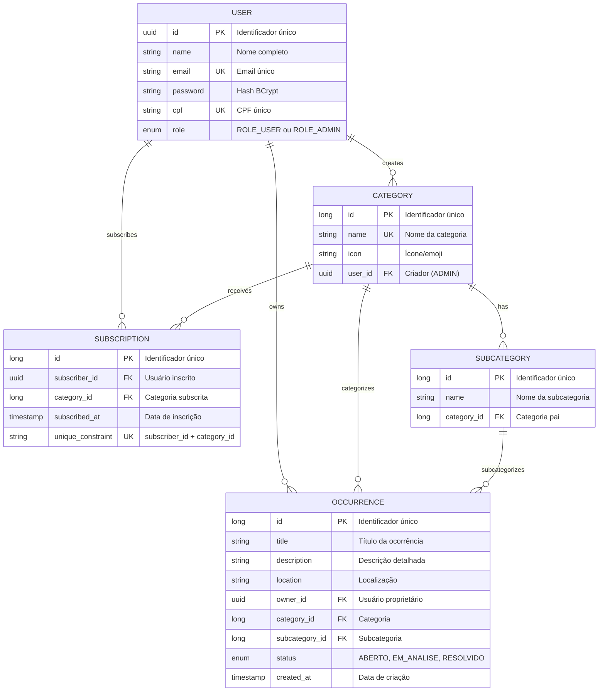

# 🎯 Tópicos Tecnicamente Relevantes para o TCC - Backend Talkie

**Projeto:** Talkie (Plataforma de Gestão de Ocorrências)  
**Data:** Setembro de 2026  
**Linguagem:** Java 17 | **Framework:** Spring Boot 3.3.5  

---

## 📌 Introdução

Este documento apresenta **14 tópicos tecnicamente interessantes** identificados na arquitetura e implementação do backend do Talkie, adequados para serem discutidos em profundidade em um TCC de Engenharia de Software.

Cada tópico inclui:
- **Relevância técnica** para a disciplina de engenharia de software
- **Como está implementado** no projeto
- **Pontos de interesse** para redação acadêmica
- **Sugestões de seções** do TCC

---

## 📊 Diagrama Modelo Entidade-Relacionamento (MER)



### 📋 Descrição do MER

**Entidades Principais:**

| Entidade | Tabela | Chave Primária | Descrição |
| --- | --- | --- | --- |
| **User** | `users` | UUID | Usuário da plataforma (email e CPF únicos) |
| **Category** | `types` | Long (Identity) | Tipo/categoria de ocorrência |
| **Subcategory** | `subcategories` | Long (Identity) | Subtipo dentro de uma categoria |
| **Occurrence** | `occurrences` | Long (Identity) | Ocorrência reportada pelos usuários |
| **Subscription** | `subscriptions` | Long (Identity) | Inscrição de usuário em categoria |

**Relacionamentos:**

- **User → Category** (1:N): Um usuário ADMIN cria múltiplas categorias
- **User → Occurrence** (1:N): Um usuário pode reportar múltiplas ocorrências (como owner)
- **User → Subscription** (1:N): Um usuário se inscreve em múltiplas categorias
- **Category → Subcategory** (1:N): Uma categoria tem múltiplas subcategorias
- **Category → Subscription** (1:N): Uma categoria tem múltiplas inscrições
- **Category → Occurrence** (1:N): Uma categoria categoriza múltiplas ocorrências
- **Subcategory → Occurrence** (1:N): Uma subcategoria subcategoriza múltiplas ocorrências

**Restrições Importantes:**

- `Email` e `CPF` são únicos em User (evitar duplicatas)
- `Nome` é único em Category (ignoring case)
- `(subscriber_id, category_id)` é único em Subscription (usuário não se inscreve 2x mesma categoria)
- `created_at` é obrigatório em Occurrence (auditoria)

---

## 1️⃣ Arquitetura em Camadas com Spring Boot

### 📋 O que é
Padrão arquitetural que divide a aplicação em camadas com responsabilidades específicas (Controller, Service, Repository, Domain).

### 🔍 Implementação no Talkie
- **Controller Layer:** Validação HTTP, mapeamento de requisições
- **Service Layer:** Lógica de negócio, orquestração
- **Repository Layer:** Abstração de acesso a dados via JPA
- **Domain Layer:** Entidades mapeadas para o banco
- **Infrastructure Layer:** Segurança, tratamento de exceções

### 💡 Pontos Interessantes para TCC
- Separação clara de responsabilidades facilitando manutenção
- Fluxo unidirecional de dependências (Controller → Service → Repository)
- Teste independente de cada camada
- Escalabilidade e reuso de código

### 📝 Sugestões de Redação
```
"O projeto Talkie implementa uma arquitetura em camadas clássica, 
garantindo que Controller não contenha lógica de negócio e Service 
não tenha acoplamento com detalhes de persistência. Essa separação..."
```

### 🎓 Seções Recomendadas
- Capítulo de Arquitetura
- Seção de Design Patterns
- Análise Comparativa (Arquitetura vs Monolítica)

---

## 2️⃣ Autenticação Stateless com JWT

### 📋 O que é
Mecanismo de autenticação sem manutenção de sessão no servidor, utilizando JSON Web Tokens (JWT).

### 🔍 Implementação no Talkie
- **TokenService:** Geração e validação de JWT com expiração (2 horas)
- **SecurityFilter:** Extrai token do header `Authorization: Bearer <token>`
- **BCrypt:** Hash seguro de senhas com salt automático
- **Spring Security:** Gerencia contexto de autenticação

### 💡 Pontos Interessantes para TCC
- Escalabilidade horizontal (sem necessidade de compartilhamento de sessão)
- Implementação de RBAC (Role-Based Access Control)
- Estratégia de expiração de token
- Diferença entre autenticação e autorização

### 🔐 Potencial de Melhoria (Para Futuro)
- Implementar refresh tokens (evitar logout a cada 2 horas)
- Proteção contra brute force em `/auth/login`
- Auditoria estruturada de eventos de autenticação

### 📝 Sugestões de Redação
```
"A arquitetura stateless com JWT elimina a necessidade de sessões 
servidor, reduzindo acoplamento e permitindo deploy em múltiplas instâncias. 
O fluxo começa no registro (RegisterDTO validado) e segue para login, 
onde credenciais são verificadas via BCrypt..."
```

### 🎓 Seções Recomendadas
- Capítulo de Segurança
- Capítulo de Autenticação e Autorização
- Discussão de Trade-offs (JWT vs Sessão)

---

## 3️⃣ Padrão Event-Driven para Desacoplamento

### 📋 O que é
Arquitetura onde componentes se comunicam via publicação e consumo de eventos, ao invés de chamadas diretas.

### 🔍 Implementação no Talkie
- **Eventos:** Classe `OccurrenceCreatedEvent` disparada ao criar ocorrência
- **Publisher:** `ApplicationEventPublisher` publica evento após persistência
- **Listener:** `OccurrenceNotificationListener` escuta o evento assincronamente
- **Assincronismo:** Notificações não bloqueiam a resposta HTTP

### 💡 Pontos Interessantes para TCC
- Desacoplamento entre Service e Listener
- Facilita adicionar novos comportamentos sem modificar código existente
- Exemplo real de padrão Observer implementado no Spring
- Vantagens: Escalabilidade, Manutenibilidade
- Desafios: Debugging, Transações distribuídas

### 🏗️ Fluxo Ilustrado
```
OccurrenceService.create()
  ↓
repository.save() → persistência síncrona
  ↓
eventPublisher.publishEvent(OccurrenceCreatedEvent)
  ↓ (requisição retorna ao cliente aqui)
  
EventListener (em thread separada)
  ↓
OccurrenceNotificationListener.onOccurrenceCreated()
  ↓
subscriptionRepository.findByCategoryId()
  ↓
emailService.send() [futuro]
```

### 📝 Sugestões de Redação
```
"O padrão event-driven implementado no Talkie exemplifica bem a aplicação 
de padrões arquiteturais modernos. Quando uma ocorrência é criada, o Service 
não chama diretamente um método de notificação. Em vez disso, publica um 
evento OccurrenceCreatedEvent que listeners podem capturar..."
```

### 🎓 Seções Recomendadas
- Capítulo de Padrões de Projeto
- Seção de Desacoplamento Arquitetural
- Discussão de Padrão Observer vs Mediator

---

## 4️⃣ Design Patterns Aplicados

### 📋 Padrões Identificados

| Padrão | Uso | Exemplo |
|--------|-----|---------|
| **MVC** | Estrutura geral | Controller → Service → Repository |
| **Repository** | Abstração de dados | `OccurrenceRepository extends JpaRepository` |
| **DTO** | Transferência de dados | `OccurrenceDTO`, `ApiResponse<T>` |
| **Dependency Injection** | IoC do Spring | `@RequiredArgsConstructor` + Lombok |
| **Observer/Event-Driven** | Desacoplamento | `OccurrenceCreatedEvent` → `Listener` |
| **Singleton** | Gerenciamento de beans | `@Service`, `@Component` |
| **Factory** | Criação de entidades | Services criam instâncias |
| **Exception Handler** | Tratamento centralizado | `@RestControllerAdvice` |
| **Security Filter** | Autenticação | `OncePerRequestFilter` customizado |

### 💡 Pontos Interessantes para TCC
- Exemplo prático de múltiplos padrões em um projeto real
- Como padrões resolvem problemas específicos
- Trade-offs entre simplicidade e flexibilidade
- Uso de padrões vs Over-engineering

### 📝 Sugestões de Redação
```
"O projeto Talkie demonstra aplicação consciente de padrões de projeto. 
O padrão Repository abstrai a complexidade do JPA; DTOs isolam entidades 
JPA do cliente; o padrão DTO é especialmente importante para REST APIs..."
```

### 🎓 Seções Recomendadas
- Capítulo dedicado a Design Patterns
- Tabela comparativa de padrões
- Análise de quando usar/não usar cada padrão

---

## 5️⃣ Tratamento Centralizado de Exceções

### 📋 O que é
Mecanismo que intercepta exceções de qualquer camada e retorna respostas HTTP padronizadas.

### 🔍 Implementação no Talkie
- **GlobalExceptionHandler:** `@RestControllerAdvice` captura exceções
- **Exceções Customizadas:** `BadRequestException`, `NotFoundException`, `UnauthorizedException`
- **Respostas Padronizadas:** `ErrorResponse` record com campos `timestamp`, `status`, `message`
- **Fluxo:** Qualquer camada lança exceção → Handler intercepta → Resposta padronizada retorna ao cliente

### 💡 Pontos Interessantes para TCC
- Padrão que evita espalhamento de try-catch por todo código
- Consistência nas respostas de erro
- Facilita logging e auditoria centralizada
- Exemplo de AOP (Aspect-Oriented Programming) implícito

### 🛠️ Benefícios
- Código mais limpo (sem try-catch espalhado)
- Mensagens de erro consistentes
- Fácil adicionar novos tipos de erro
- Client recebe HTTP code apropriado (400, 401, 404, 500)

### 📝 Sugestões de Redação
```
"O tratamento centralizado de exceções via GlobalExceptionHandler exemplifica 
o princípio DRY (Don't Repeat Yourself). Cada camada lança exceções específicas, 
sabendo que serão interceptadas e retornarão response HTTP apropriada..."
```

### 🎓 Seções Recomendadas
- Seção de Tratamento de Erros
- Discussão de HTTP Status Codes
- Boas Práticas de API Design

---

## 6️⃣ Testes com BDD (Cucumber) e Integração

### 📋 O que é
Abordagem de testes que escreve cenários em linguagem natural (Gherkin), permitindo especificação executável do comportamento.

### 🔍 Implementação no Talkie
- **Cucumber Framework:** Testes BDD em arquivos `.feature`
- **JUnit 5:** Testes unitários e de integração
- **BDD Scenarios:** Escritos em português (Dado/Quando/Então)
- **Test Profiles:** `@ActiveProfiles("test")` com banco H2

### 💡 Pontos Interessantes para TCC
- Ponte entre técnico (dev) e não-técnico (product owner)
- Especificação viva (testes documentam comportamento esperado)
- Exemplo de Test-Driven Development (TDD)
- Cobertura de múltiplos cenários: sucesso, erro, edge cases

### 📝 Exemplo de Cenário BDD
```gherkin
Cenário: Criar ocorrência com dados válidos
  Dado que sou um usuário autenticado
  Quando crio uma ocorrência com título "Buraco na rua"
  Então a ocorrência deve ser salva
  E devo receber status 200
```

### 📝 Sugestões de Redação
```
"Os testes BDD com Cucumber servem duplo propósito: especificar 
requisitos de forma executável e documentar comportamento esperado. 
Os cenários são escritos em português, facilitando comunicação com 
stakeholders não-técnicos..."
```

### 🎓 Seções Recomendadas
- Capítulo de Testes e Qualidade
- Seção de BDD e Test-Driven Development
- Exemplos de Cenários Testados

---

## 7️⃣ ORM com JPA/Hibernate e Flyway Migrations

### 📋 O que é
- **JPA:** Especificação para mapeamento objeto-relacional (ORM)
- **Hibernate:** Implementação de JPA que traduz operações Java para SQL
- **Flyway:** Ferramenta para controle de versão de banco de dados (database versioning)

### 🔍 Implementação no Talkie
- **Entidades JPA:** Anotadas com `@Entity`, `@Table`, `@Column`, relacionamentos via `@ManyToOne`, `@OneToMany`
- **Cascade:** Configurado para manter integridade referencial
- **Flyway Migrations:** Versões de schema (V1, V2, V3) controladas em `.sql`
- **DDL Auto:** Configurado como `validate` (não cria tabelas automaticamente)

### 💡 Pontos Interessantes para TCC
- Abstração de banco de dados (portabilidade)
- Lazy loading vs Eager loading e seus impactos
- Transações ACID e controle de concorrência
- Versionamento de schema como código
- Benefícios de migrations: rastreabilidade, rollback, CI/CD

### 🏗️ Relacionamentos Implementados
```
User (1) ──→ (N) Category
User (1) ──→ (N) Occurrence (via owner)
Category (1) ──→ (N) Subcategory
Category (1) ──→ (N) Subscription
Subscription N:N (User ↔ Category)
```

### 📝 Sugestões de Redação
```
"O uso de JPA/Hibernate abstrai a complexidade de queries SQL, permitindo 
que o desenvolvedor trabalhe com entidades Java. Flyway garante que 
o schema evolua de forma controlada, sincronizado com o código fonte..."
```

### 🎓 Seções Recomendadas
- Capítulo de Persistência
- Seção de ORM e seus Trade-offs
- Discussão de Lazy Loading vs Eager Loading
- Migrações de Banco de Dados

---

## 8️⃣ API RESTful com Documentação Swagger/OpenAPI

### 📋 O que é
- **REST:** Representational State Transfer (padrão arquitetural)
- **Swagger/OpenAPI:** Documentação automática e interativa de APIs

### 🔍 Implementação no Talkie
- **Endpoints REST:** `GET`, `POST`, `PUT`, `DELETE` organizados por recurso
- **Stateless:** Cada requisição é independente (HTTP é stateless)
- **Content Negotiation:** Respostas JSON com Media Type `application/json`
- **Swagger UI:** Documentação automática em `/swagger-ui/index.html`
- **Documentação Automática:** Annotations `@Operation`, `@Parameter`, `@ApiResponse`

### 💡 Pontos Interessantes para TCC
- Princípios de design REST (recursos, métodos HTTP, status codes)
- Diferença entre SOAP e REST
- Como documentação automática facilita integração
- Versionamento de API e backward compatibility
- Hypermedia (HATEOAS) e evoluções futuras

### 📝 Exemplo REST Talkie
```
GET    /api/occurrences              → Listar todas
POST   /api/occurrences              → Criar nova
GET    /api/occurrences/{id}         → Buscar por ID
PUT    /api/occurrences/{id}         → Atualizar
DELETE /api/occurrences/{id}         → Deletar
```

### 📝 Sugestões de Redação
```
"A API Talkie segue princípios REST, utilizando URLs para recursos 
e métodos HTTP para operações (GET, POST, PUT, DELETE). O Swagger 
fornece documentação automática e interativa, reduzindo necessidade 
de documentação manual..."
```

### 🎓 Seções Recomendadas
- Capítulo de API REST
- Seção de Princípios REST
- Discussão de HTTP Status Codes
- Documentação e Contrato de API

---

## 9️⃣ Segurança em Aplicações Web (RBAC e BCrypt)

### 📋 O que é
- **RBAC:** Role-Based Access Control (controle de acesso baseado em papéis)
- **BCrypt:** Algoritmo de hash adaptativo para senhas
- **OWASP Top 10:** Considerações de segurança

### 🔍 Implementação no Talkie
- **Roles:** `ROLE_USER` (padrão) e `ROLE_ADMIN`
- **BCryptPasswordEncoder:** Hash seguro com salt automático
- **SecurityConfig:** Centraliza permissões de rota
- **Validação de Entrada:** DTOs com anotações `@Email`, `@NotBlank`
- **Proteção CSRF:** Spring Security mitiga automaticamente

### 💡 Pontos Interessantes para TCC
- Diferença entre autenticação (quem é?) e autorização (o que pode fazer?)
- Escalabilidade de RBAC vs ABAC
- Proteções contra ataques comuns: SQL Injection, XSS, CSRF
- Princípio do menor privilégio (least privilege)
- Importância de validação em camadas

### 🛡️ Vulnerabilidades Mitigadas
```
✅ SQL Injection       → Prepared Statements via JPA
✅ Brute Force        → [Planejado: Rate Limiting]
✅ Session Hijacking  → JWT Stateless
✅ Password Weak      → BCrypt + Validação
✅ CSRF               → Spring Security Token
❌ Brute Force        → [Não implementado]
❌ Auditoria          → [Não implementado]
```

### 📝 Sugestões de Redação
```
"A segurança é implementada em múltiplas camadas no Talkie. No nível 
de autenticação, senhas são hasheadas com BCrypt, um algoritmo adaptativo 
que torna força bruta impraticável. No nível de autorização, o RBAC 
permite diferenciar permissões entre usuários comuns e administradores..."
```

### 🎓 Seções Recomendadas
- Capítulo de Segurança
- Seção de Vulnerabilidades e Mitigações
- Discussão de OWASP Top 10
- Boas Práticas de Segurança em REST APIs

---

## 🔟 Persistência com Spring Data JPA

### 📋 O que é
Abstração Spring que reduz boilerplate de acesso a dados, fornecendo CRUD automático via interfaces.

### 🔍 Implementação no Talkie
- **Repositories:** Interfaces estendendo `JpaRepository<T, ID>`
- **Query Methods:** Nomes de métodos geram queries automaticamente
  ```java
  findByOwnerId(UUID id)
  findByCategoryId(Long categoryId)
  findByNameIgnoreCase(String name)
  ```
- **Custom Queries:** Anotação `@Query` para queries customizadas
- **Transações:** `@Transactional` garante ACID

### 💡 Pontos Interessantes para TCC
- Como Spring Data reduz código boilerplate
- Geração dinâmica de queries a partir de nomes de métodos
- Paginação e sorting automático via `Page<T>`, `Pageable`
- Transações e consistência de dados
- Lazy loading e N+1 problem

### 🏃 Exemplos Talkie
```java
// Findby methods gerados automaticamente
userRepository.findByEmail("user@example.com")
subscriptionRepository.findByCategoryId(1L)
occurrenceRepository.findByOwnerId(userId)
categoryRepository.findByNameIgnoreCase("Infraestrutura")
```

### 📝 Sugestões de Redação
```
"Spring Data JPA fornece abstração que elimina código boilerplate. 
Simples interfaces estendendo JpaRepository ganham automaticamente 
métodos CRUD (Create, Read, Update, Delete) e capabilities de query..."
```

### 🎓 Seções Recomendadas
- Capítulo de Persistência
- Seção de ORM e Spring Data
- Discussão de Query Performance

---

## 1️⃣1️⃣ Inversão de Controle (IoC) e Injeção de Dependência

### 📋 O que é
Padrão onde objetos não criam suas dependências; o container as fornece.

### 🔍 Implementação no Talkie
- **Spring Container:** Gerencia ciclo de vida de beans
- **@Autowired Implícito:** Lombok `@RequiredArgsConstructor` + fields `final`
- **Loose Coupling:** Services não dependem de implementações concretas de Repository
- **Testabilidade:** Fácil mockar dependências em testes

### 💡 Pontos Interessantes para TCC
- Diferença entre IoC e Dependency Injection
- Benefícios: Desacoplamento, Testabilidade, Flexibilidade
- Spring Container vs Constructor Injection
- Ciclo de vida de beans (scope)

### 🔄 Exemplo Talkie
```java
@Service
@RequiredArgsConstructor  // Lombok gera constructor
public class OccurrenceService {
    private final OccurrenceRepository repository;  // Injetada
    private final CategoryRepository categoryRepository;
    
    // Spring injeta automaticamente ao criar bean
}
```

### 📝 Sugestões de Redação
```
"A injeção de dependência fornecida pelo Spring permite que cada 
componente declare suas dependências sem criá-las. Isso reduz acoplamento, 
facilita testes (mockando dependências) e permite configurações flexíveis..."
```

### 🎓 Seções Recomendadas
- Capítulo de Arquitetura
- Seção de Padrões de Projeto
- Discussão de Benefícios da IoC

---

## 1️⃣2️⃣ Bean Validation e DTOs Imutáveis (Records)

### 📋 O que é
- **Bean Validation:** Anotações padrão (Jakarta) para validar dados
- **Records:** Tipo Java que cria imutável, thread-safe data carriers

### 🔍 Implementação no Talkie
- **Validação:** Anotações `@Valid`, `@Email`, `@NotBlank`, `@Size`
- **DTOs como Records:** Imutáveis, sem boilerplate getter/setter
- **Validação Automática:** Spring valida antes de chamar controller

### 💡 Pontos Interessantes para TCC
- Diferença entre validação client-side vs server-side
- Imutabilidade e thread-safety
- Records vs Classes tradicionais (redução de código)
- Separação entre DTO (transfer) e Entity (persistence)

### 📝 Exemplo Talkie
```java
public record RegisterDTO(
    @NotBlank(message = "Nome é obrigatório")
    String name,
    
    @Email
    String email,
    
    @NotBlank
    @Size(min = 6)
    String password
) {}

// Validação automática antes de chamar controller
@PostMapping("/register")
public ResponseEntity<...> register(@Valid @RequestBody RegisterDTO dto) {
    // Aqui já sabemos que dto é válido
}
```

### 📝 Sugestões de Redação
```
"Records foram adotados para DTOs neste projeto, oferecendo imutabilidade 
e eliminando boilerplate (getters, setters, equals, hashCode). Validações 
via anotações Spring ocorrem automaticamente, reduzindo code duplication..."
```

### 🎓 Seções Recomendadas
- Capítulo de Validação
- Seção de Tipos de Dados (Records vs Classes)
- Boas Práticas de DTO Design

---

## 1️⃣3️⃣ Filtros de Segurança Customizados

### 📋 O que é
Interceptadores que processam requisições HTTP antes de chegar ao controller, úteis para autenticação, logging, CORS.

### 🔍 Implementação no Talkie
- **SecurityFilter:** Estende `OncePerRequestFilter`
- **Fluxo:** Extrai JWT do header → Valida token → Injeta usuário no SecurityContext
- **Reutilização:** Filter executa uma vez por requisição

### 💡 Pontos Interessantes para TCC
- Padrão Filter Chain (processamento em pipeline)
- Separação de concerns (autenticação fora do controller)
- Performance (validação antes de chegar a lógica custosa)
- Logging e auditing centralizados

### 🔄 Fluxo Talkie
```
HTTP Request
  ↓
SecurityFilter.doFilterInternal()
  - Extrai token do header "Authorization: Bearer ..."
  - TokenService.validateToken(token)
  - TokenService.getRole(token)
  - UserRepository.findByEmail(subject)
  - Injeta UsernamePasswordAuthenticationToken no SecurityContext
  ↓
Requisição prossegue autenticada
  ↓
Controller pode chamar AuthenticatedUser.get()
```

### 📝 Sugestões de Redação
```
"Filtros customizados implementam autenticação sem poluir controllers. 
SecurityFilter intercepta cada requisição, validando JWT antes que 
chegue à lógica de negócio, mantendo separação de concerns..."
```

### 🎓 Seções Recomendadas
- Capítulo de Autenticação
- Seção de Filtros e Interceptadores
- Arquitetura de Security Filters

---

## 1️⃣4️⃣ Publicação de Eventos Assíncronos

### 📋 O que é
Mecanismo para desacoplar operações, permitindo que listeners processem eventos sem bloquear fluxo principal.

### 🔍 Implementação no Talkie
- **Publisher:** `ApplicationEventPublisher` publica evento após persistência
- **Listener:** `@EventListener` captura evento em thread separada
- **Caso de Uso:** Notificações disparadas sem bloquear resposta HTTP
- **Benefício:** Escalabilidade (novos listeners sem modificar Service)

### 💡 Pontos Interessantes para TCC
- Padrão Pub/Sub vs Chamada Direta
- Assincronismo e threading
- Resiliência (falha em listener não afeta fluxo principal)
- Trade-offs: Complexity vs Decoupling

### 🔄 Exemplo Talkie
```
OccurrenceService.create()
  ├─ repository.save(occurrence)        // Síncrono
  └─ eventPublisher.publishEvent(...)   // Assíncrono

// Listener escuta em background
OccurrenceNotificationListener
  ├─ subscriptionRepository.findByCategoryId()
  └─ emailService.sendNotification()    // [Futuro]
```

### 📝 Sugestões de Redação
```
"A publicação assíncrona de eventos exemplifica desacoplamento em 
arquiteturas distribuídas. Após persistir uma ocorrência, o Service 
publica um evento que listeners podem capturar, sem conhecimento entre eles..."
```

### 🎓 Seções Recomendadas
- Capítulo de Padrões Arquiteturais
- Seção de Pub/Sub e Event-Driven
- Discussão de Assincronismo vs Sincronismo

---

## 📊 Tabela Resumida de Tópicos

| # | Tópico | Complexidade | Relevância | Status no Projeto |
|---|--------|--------------|------------|-------------------|
| 1 | Arquitetura em Camadas | Média | ⭐⭐⭐ | ✅ Implementado |
| 2 | JWT + Stateless Auth | Alta | ⭐⭐⭐ | ✅ Implementado |
| 3 | Event-Driven | Média | ⭐⭐⭐ | ✅ Implementado |
| 4 | Design Patterns | Média | ⭐⭐⭐ | ✅ Implementado |
| 5 | Exception Handling | Baixa | ⭐⭐ | ✅ Implementado |
| 6 | BDD + Testes | Média | ⭐⭐⭐ | ✅ Implementado |
| 7 | ORM + Flyway | Média | ⭐⭐⭐ | ✅ Implementado |
| 8 | REST + OpenAPI | Média | ⭐⭐⭐ | ✅ Implementado |
| 9 | Segurança (RBAC) | Média | ⭐⭐⭐ | ✅ Implementado |
| 10 | Spring Data JPA | Baixa | ⭐⭐ | ✅ Implementado |
| 11 | IoC + DI | Média | ⭐⭐⭐ | ✅ Implementado |
| 12 | Bean Validation | Baixa | ⭐⭐ | ⚠️ Parcial |
| 13 | Security Filters | Média | ⭐⭐⭐ | ✅ Implementado |
| 14 | Eventos Assíncronos | Média | ⭐⭐⭐ | ✅ Implementado |

---

## 🎓 Sugestão de Estrutura para o TCC

### Parte I: Fundamentação Teórica
1. Capítulo: Arquitetura de Software
   - Padrões Arquiteturais (MVC, Layered, Event-Driven)
   - Princípios SOLID

2. Capítulo: Segurança em Aplicações Web
   - Autenticação vs Autorização
   - JWT e Tokens Stateless
   - RBAC e Controle de Acesso

3. Capítulo: Padrões de Projeto
   - Repository, DTO, Observer, Singleton
   - Quando usar, quando não usar

### Parte II: Estudo de Caso Prático
4. Capítulo: Arquitetura do Talkie
   - Visão Geral
   - Camadas Implementadas
   - Fluxos de Dados

5. Capítulo: Análise Técnica Detalhada
   - Autenticação (2 páginas)
   - Event-Driven (2 páginas)
   - Testes (1 página)
   - Segurança (2 páginas)

6. Capítulo: Decisões de Design
   - Por que JWT e não Sessão?
   - Por que Event-Driven?
   - Alternativas consideradas

### Parte III: Conclusões e Futuro
7. Capítulo: Pontos Fortes e Fracos
   - Avaliação da Arquitetura
   - Recomendações de Melhoria

8. Capítulo: Trabalhos Futuros
   - Melhorias Planejadas
   - Escalabilidade
   - Performance

---

## 💡 Dicas para a Redação

### ✅ Faça
- ✓ Use exemplos concretos do código
- ✓ Cite números (ex: "17 classes de teste")
- ✓ Inclua diagramas (Sequência, Classes, ER)
- ✓ Discuta trade-offs (JWT vs Sessão, Síncrono vs Assíncrono)
- ✓ Relacione com teoria (SOLID, Gang of Four patterns)
- ✓ Mostre code snippets comentados

### ❌ Não Faça
- ✗ Copie código inteiro (máximo 10-15 linhas por snippet)
- ✗ Repita conteúdo (resuma ao invés de copiar)
- ✗ Esqueça de citar referências (Spring docs, OWASP, RFC)
- ✗ Foque só em código; discuta decisões arquiteturais
- ✗ Escreva TCC como se fosse documentação de API

---

## 📚 Referências Recomendadas

### Livros Clássicos
- "Design Patterns" — Gang of Four
- "Clean Architecture" — Robert C. Martin
- "Enterprise Integration Patterns" — Gregor Hohpe

### Padrões e Especificações
- JWT (RFC 7519): https://tools.ietf.org/html/rfc7519
- REST Architectural Constraints: https://www.ics.uci.edu/~fielding/pubs/dissertation/rest_arch_style.htm
- OWASP Top 10: https://owasp.org/www-project-top-ten/

### Documentação Técnica
- Spring Framework: https://spring.io/projects/spring-framework
- Spring Security: https://spring.io/projects/spring-security
- Spring Data JPA: https://spring.io/projects/spring-data-jpa
- Hibernate ORM: https://hibernate.org/orm/

---

## 🎯 Próximos Passos

1. **Escolha 3-4 tópicos** de maior interesse (recomendação: Arquitetura, Autenticação, Event-Driven, Testes)
2. **Estruture o TCC** conforme sugestão acima
3. **Aprofunde-se** em cada tópico com leitura teórica
4. **Compare** implementação Talkie com boas práticas
5. **Identifique** pontos fortes e fracos
6. **Proponha** melhorias e trabalhos futuros

---

**Documento preparado em:** Setembro de 2026  
**Para:** Trabalho de Conclusão de Curso  
**Projeto:** Talkie - Plataforma de Gestão de Ocorrências
