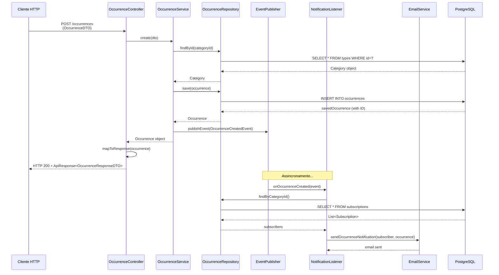
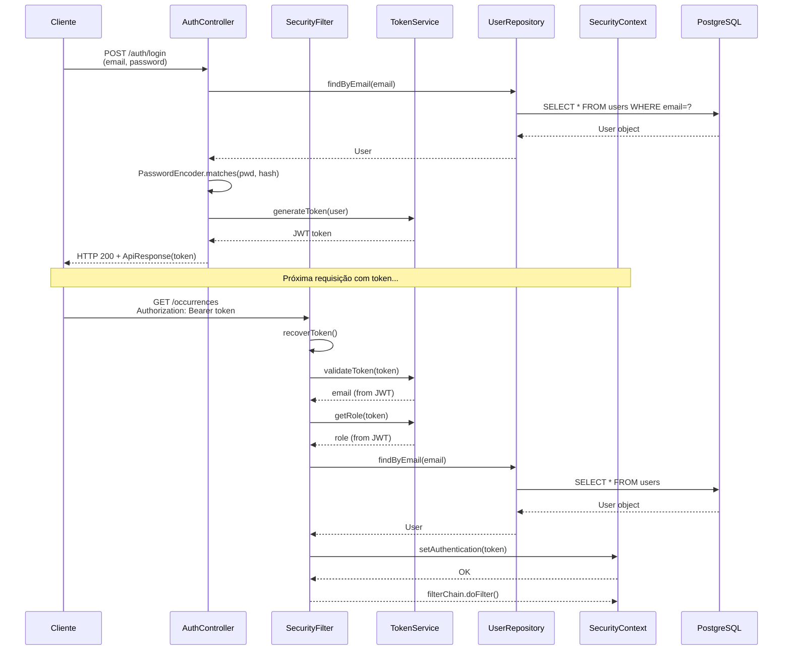
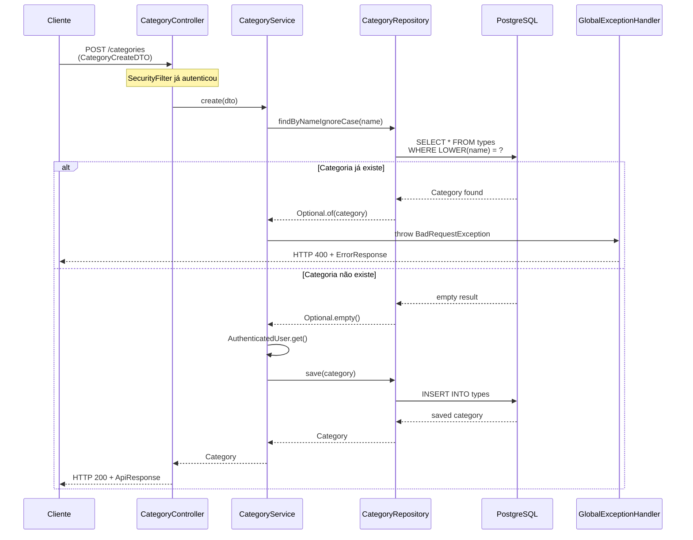
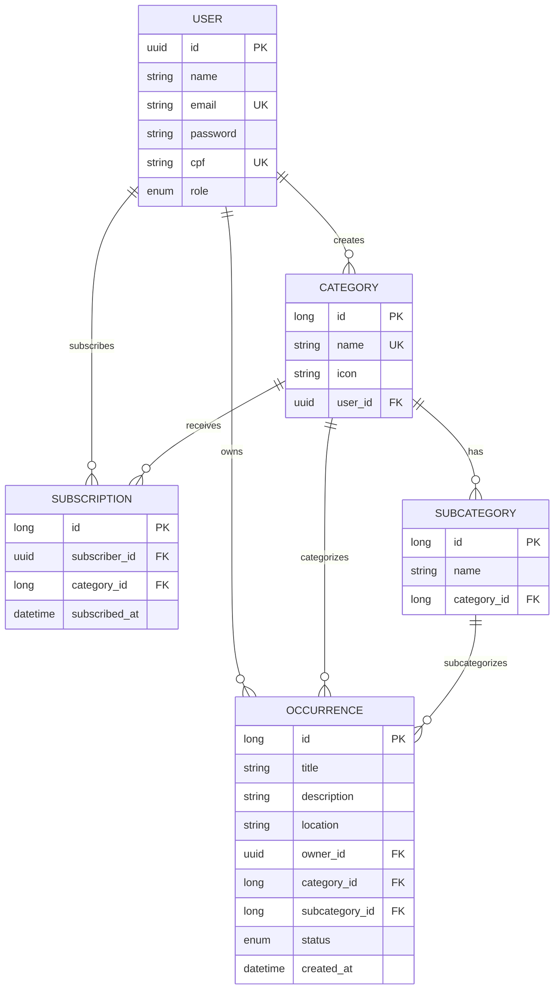

# 📊 Análise da Arquitetura - Projeto Talkie

**Data da Análise:** 27 de agosto de 2026  
**Foco:** Comunicação entre camadas e fluxos de requisição  
**Autor:** Claude Code (TCC Analyzer)

---

## Sumário

1. [Visão Geral](#1-visão-geral)
2. [Arquitetura e Camadas](#2-arquitetura-e-camadas)
3. [Comunicação Entre Camadas](#3-comunicação-entre-camadas)
4. [Fluxos Principais com Diagramas](#4-fluxos-principais-com-diagramas)
5. [Modelo de Dados](#5-modelo-de-dados)
6. [Padrões de Projeto Identificados](#6-padrões-de-projeto-identificados)
7. [Pontos Fortes](#7-pontos-fortes)
8. [Pontos Fracos e Sugestões de Melhoria](#8-pontos-fracos-e-sugestões-de-melhoria)
9. [Sugestão de Redação para o TCC](#9-sugestão-de-redação-para-o-tcc)
10. [JSON Estruturado](#10-json-estruturado)

---

## 1. Visão Geral

### Stack Tecnológica

| Componente | Versão | Descrição |
|-----------|--------|-----------|
| **Linguagem** | Java 17 | Linguagem de programação |
| **Framework** | Spring Boot 3.3.5 | Framework web |
| **Build** | Maven | Ferramenta de construção |
| **Banco de Dados** | PostgreSQL | Banco de dados de produção |
| **Banco de Dados (Testes)** | H2 | Banco de dados em memória |
| **Segurança** | Spring Security + JWT | Autenticação e autorização |
| **Persistência** | Spring Data JPA + Hibernate | ORM |
| **Testes** | JUnit 5 + Cucumber | Testes unitários e BDD |
| **Documentação** | Swagger/OpenAPI | Documentação automática |
| **Utilitários** | Lombok | Redução de boilerplate |

### Tamanho do Projeto

- **Arquivos Java:** ~50 classes de aplicação
- **Testes:** 17 classes de teste (cobertura BDD + Integração)
- **Linhas de código:** ~3.500 linhas (core)
- **Estratégia de análise:** Leitura completa de arquivos-chave (pom.xml, controllers, services, entities, configs, listeners)

---

## 2. Arquitetura e Camadas

O projeto implementa uma **arquitetura em camadas clássica** com fluxo unidirecional e separação clara de responsabilidades.

### Estrutura de Camadas

```
┌─────────────────────────────────────────────┐
│         HTTP Client / Frontend              │
└────────────────────┬────────────────────────┘
                     │
         ┌───────────▼───────────┐
         │   CONTROLLER LAYER    │
         │  (Endpoints REST)     │
         └───────────┬───────────┘
                     │
         ┌───────────▼───────────┐
         │    SERVICE LAYER      │
         │  (Lógica de Negócio)  │
         └───────────┬───────────┘
                     │
     ┌───────────────┼───────────────┐
     │               │               │
┌────▼─────┐ ┌──────▼──────┐ ┌──────▼───────┐
│Repository│ │Event System │ │ Security     │
│ (Data)   │ │(Publisher)  │ │ (Filters)    │
└────┬─────┘ └──────┬──────┘ └──────────────┘
     │              │
     │         ┌────▼────────┐
     │         │  LISTENERS  │
     │         │  (Async)    │
     │         └────────────┘
     │
     └────────────┬──────────────┐
                  │              │
         ┌────────▼────────┐  ┌──▼────────┐
         │ JPA Repository  │  │  Domain   │
         │  (Interfaces)   │  │(Entities) │
         └────────┬────────┘  └───────────┘
                  │
         ┌────────▼────────┐
         │  Hibernate ORM  │
         └────────┬────────┘
                  │
         ┌────────▼────────┐
         │   PostgreSQL    │
         │   Database      │
         └─────────────────┘
```

### Camadas Identificadas

| Camada | Pacote | Responsabilidade | Exemplos |
|--------|--------|---|---|
| **Controller** | `controller/` | Validar requisições, chamar serviços, retornar `ResponseEntity<ApiResponse<T>>` | `OccurrenceController`, `AuthController` |
| **Service** | `service/` | Orquestrar repositórios, aplicar regras de negócio, publicar eventos | `OccurrenceService`, `CategoryService` |
| **Repository** | `repository/` | Abstrair acesso a dados (JpaRepository) | `OccurrenceRepository`, `UserRepository` |
| **Domain** | `domain/` | Entidades JPA (mapeamento objeto-relacional) | `Occurrence`, `User`, `Category` |
| **DTO** | `dto/` | Transferência de dados (request/response) | `OccurrenceDTO`, `ApiResponse<T>` |
| **Infrastructure** | `infra/` | Segurança, exceções, filtros | `SecurityConfig`, `SecurityFilter`, `GlobalExceptionHandler` |
| **Events** | `events/` | Definição de eventos da aplicação | `OccurrenceCreatedEvent` |
| **Listeners** | `listeners/` | Ouvintes de eventos (execução assíncrona) | `OccurrenceNotificationListener` |

---

## 3. Comunicação Entre Camadas

Este é o ponto central desta análise: **como as camadas se comunicam**.

### 3.1 Fluxo Síncrono (Requisição-Resposta)

A comunicação **síncrona** segue este padrão:

```
CLIENT → CONTROLLER → SERVICE → REPOSITORY → DATABASE
  ↑                                            ↓
  └────────────────────────────────────────────
```

#### Exemplo Concreto: Criar uma Ocorrência

1. **Cliente** envia `POST /occurrences` com `OccurrenceDTO`

2. **Controller** (`OccurrenceController.create()`)
   - Recebe o DTO validado via `@Valid`
   - Chama `service.create(dto)`
   - Envolve a resposta em `ApiResponse<T>` e retorna `ResponseEntity`

3. **Service** (`OccurrenceService.create()`)
   - Obtém o usuário autenticado via `AuthenticatedUser.get()`
   - Valida categorias e subcategorias via repositórios
   - Cria a entidade `Occurrence`
   - **Salva no banco** via `repository.save()`
   - **Publica evento** via `eventPublisher.publishEvent()`

4. **Repository** (JpaRepository)
   - Abstrai a persistência
   - Hibernate mapeia para SQL
   - PostgreSQL persiste os dados

5. **Resposta retorna** na ordem inversa:
   - Service retorna `Occurrence` salva
   - Controller mapeia para DTO (`OccurrenceResponseDTO`)
   - HTTP 200 com `ApiResponse<OccurrenceResponseDTO>`

#### Pseudocódigo da Comunicação

```java
// Controller recebe e valida
@PostMapping
public ResponseEntity<ApiResponse<OccurrenceResponseDTO>> create(@Valid OccurrenceDTO data) {
    // 1. Chama Service
    Occurrence created = service.create(data);
    
    // 2. Mapeia para DTO (conversão de entidade para DTO)
    OccurrenceResponseDTO response = new OccurrenceResponseDTO(...);
    
    // 3. Envolve em ApiResponse (padrão de resposta)
    return ResponseEntity.ok(new ApiResponse<>("Sucesso", response));
}

// Service aplica lógica e publica evento
@Service
public Occurrence create(OccurrenceDTO dto) {
    // Busca relacionamentos
    Category category = categoryRepository.findById(dto.categoryId())
        .orElseThrow(...);
    
    // Obtém usuário do contexto de autenticação
    User user = AuthenticatedUser.get();
    
    // Constrói entidade
    Occurrence occurrence = new Occurrence();
    occurrence.setCategory(category);
    occurrence.setOwner(user);
    
    // Persiste (chamada a Repository)
    Occurrence savedOccurrence = repository.save(occurrence);
    
    // Publica evento (comunicação assíncrona)
    eventPublisher.publishEvent(new OccurrenceCreatedEvent(savedOccurrence));
    
    return savedOccurrence;
}

// Repository abstrai persistência
public interface OccurrenceRepository extends JpaRepository<Occurrence, Long> {
    List<Occurrence> findByOwnerId(UUID ownerId);
    List<Occurrence> findByCategoryId(Long categoryId);
}
```

### 3.2 Fluxo Assíncrono (Event-Driven)

A aplicação implementa um padrão **event-driven** para desacoplamento:

```
SERVICE 
  ↓
EVENT PUBLISHER
  ↓
EVENT (OccurrenceCreatedEvent)
  ↓
LISTENER (@EventListener)
  ↓
REPOSITORY / SERVICE (para ações secundárias)
  ↓
EMAIL / NOTIFICAÇÃO
```

#### Exemplo: Notificação ao Criar Ocorrência

```java
// 1. Service publica evento após salvar
@Service
public Occurrence create(OccurrenceDTO dto) {
    // ... validações e persistência ...
    Occurrence savedOccurrence = repository.save(occurrence);
    
    // Publica evento (dispara listeners)
    eventPublisher.publishEvent(new OccurrenceCreatedEvent(savedOccurrence));
    
    return savedOccurrence;
}

// 2. Listener captura o evento (assincronamente)
@Component
public class OccurrenceNotificationListener {
    @EventListener
    public void onOccurrenceCreated(OccurrenceCreatedEvent event) {
        // Obtém dados do evento
        Occurrence occurrence = event.getOccurrence();
        
        // Usa repositório para buscar subscribers
        var subscribers = subscriptionRepository.findByCategoryId(
            occurrence.getCategory().getId()
        );
        
        // Itera e envia notificações
        subscribers.forEach(sub -> {
            emailService.sendOccurrenceNotification(
                sub.getSubscriber(), 
                occurrence
            );
        });
    }
}
```

**Vantagens deste padrão:**

- **Desacoplamento:** Service não conhece o listener
- **Escalabilidade:** Novos listeners podem ser adicionados sem modificar o Service
- **Assincronismo:** Notificações não bloqueiam a resposta da API

### 3.3 Fluxo de Autenticação e Segurança

```
HTTP REQUEST with JWT
    ↓
SECURITY FILTER (SecurityFilter)
    ↓ extracts token
TOKEN SERVICE (TokenService)
    ↓ validates & extracts claims
USER REPOSITORY (UserRepository)
    ↓ loads user from DB
SECURITY CONTEXT (Spring Security)
    ↓ stores authentication
CONTROLLER (with @RequiredArgsConstructor)
    ↓ can access AuthenticatedUser
SERVICE (uses AuthenticatedUser.get())
    ↓
PERSISTENCE
```

#### Sequência Detalhada

1. **Cliente** envia: `Authorization: Bearer <jwt_token>`

2. **SecurityFilter** intercepta
   - Extrai token do header
   - Chama `TokenService.validateToken()`
   - Chama `TokenService.getRole()`

3. **TokenService** (JWT)
   - Decodifica token
   - Valida assinatura
   - Retorna email e role

4. **UserRepository** (JPA)
   - Busca usuário por email
   - `userRepository.findByEmail(login)`

5. **SecurityContext** (Spring Security)
   - Injeta `UsernamePasswordAuthenticationToken`
   - Define authorities

6. **Service/Controller** (posteriormente)
   - Acessa usuário via `AuthenticatedUser.get()`
   - Ou apenas o ID via `AuthenticatedUser.getId()`

### 3.4 Tratamento de Erros (Unidirecional)

```
ANY LAYER throws Exception
    ↓
GLOBAL EXCEPTION HANDLER (@RestControllerAdvice)
    ↓
SPECIFIC HANDLERS (@ExceptionHandler)
    ↓
ERROR RESPONSE (ErrorResponse record)
    ↓
CLIENT receives HTTP + JSON error
```

#### Mapeamento de Exceções

```java
@RestControllerAdvice
public class GlobalExceptionHandler {
    
    @ExceptionHandler(BadRequestException.class)
    → HTTP 400 + ErrorResponse
    
    @ExceptionHandler(NotFoundException.class)
    → HTTP 404 + ErrorResponse
    
    @ExceptionHandler(UnauthorizedException.class)
    → HTTP 401 + ErrorResponse
    
    @ExceptionHandler(RuntimeException.class)
    → HTTP 400 + ErrorResponse
}
```

Qualquer camada (Controller, Service, Repository) pode lançar `BadRequestException`, `NotFoundException`, etc. O handler centralizado captura e retorna respostas consistentes.

---

## 4. Fluxos Principais com Diagramas

### Fluxo 1: Criar Ocorrência (Síncrono + Assíncrono)



### Fluxo 2: Login e Autenticação



### Fluxo 3: Salvar Categoria (com Validação)



---

## 5. Modelo de Dados

### Entidades Principais

| Entidade | Tabela | ID | Descrição |
|----------|--------|-----|----------|
| **User** | `users` | UUID | Usuário da plataforma (email único, cpf único) |
| **Category** | `types` | Long (Identity) | Tipo de ocorrência (infraestrutura, segurança, etc.) |
| **Subcategory** | `subcategories` | Long (Identity) | Subtipo dentro de uma categoria |
| **Occurrence** | `occurrences` | Long (Identity) | Ocorrência reportada |
| **Subscription** | `subscriptions` | Long (Identity) | Inscrição do usuário em categoria |

### Diagrama Entidade-Relacionamento



### Relacionamentos Detalhados

```java
// User → Category (1:N)
@OneToMany(mappedBy = "user", cascade = CascadeType.ALL)
private List<Category> categories;

// User → Occurrence (1:N) - via "owner"
@ManyToOne
@JoinColumn(name = "owner_id")
private User owner;

// Category → Subcategory (1:N)
@OneToMany(mappedBy = "category", cascade = CascadeType.ALL)
private List<Subcategory> subcategories;

// Occurrence → Category (N:1)
@ManyToOne
@JoinColumn(name = "category_id")
private Category category;

// Subscription (N:N between User and Category)
@ManyToOne
private User subscriber;

@ManyToOne
private Category category;

// Constraint único: (subscriber_id, category_id)
@UniqueConstraint(columnNames = {"subscriber_id", "category_id"})
```

---

## 6. Padrões de Projeto Identificados

| Padrão | Uso | Exemplo |
|--------|-----|---------|
| **MVC / Layered Architecture** | Estrutura geral | Controller → Service → Repository → Model |
| **Repository** | Abstração de dados | `OccurrenceRepository extends JpaRepository` |
| **DTO (Data Transfer Object)** | Transferência entre camadas | `OccurrenceDTO`, `OccurrenceResponseDTO` (record) |
| **Service Locator** | Injeção de dependência | `@RequiredArgsConstructor` + `final` fields |
| **Observer / Event-Driven** | Desacoplamento assíncrono | `OccurrenceCreatedEvent` → `OccurrenceNotificationListener` |
| **Singleton** | Componentes Spring | `@Service`, `@Component`, `@Configuration` |
| **Factory** | Criação de entidades | Services criam entidades (ex: `new Occurrence()`) |
| **Exception Handler** | Tratamento centralizado | `@RestControllerAdvice` + `@ExceptionHandler` |
| **Security Filter** | Autenticação/Autorização | `OncePerRequestFilter` para validar JWT |

---

## 7. Pontos Fortes

✅ **Separação clara de responsabilidades**
- Cada camada tem um propósito específico
- Controller não contém lógica de negócio
- Entidades JPA não são retornadas diretamente

✅ **Desacoplamento via Events**
- Service publica evento após criar ocorrência
- Listener implementa notificação sem acoplar ao Service
- Fácil adicionar novos listeners

✅ **Segurança bem implementada**
- JWT com validação em cada requisição
- BCrypt para hash de senhas
- SecurityFilter reutilizável
- Roles bem definidas (USER, ADMIN)

✅ **DTOs como camada de isolamento**
- Usa `record` para imutabilidade
- Separa Request de Response
- Não expõe entidades JPA

✅ **Tratamento centralizado de exceções**
- `@RestControllerAdvice` captura todas as exceções
- Respostas padronizadas
- Fácil adicionar novos tipos de erro

✅ **Testes abrangentes**
- 17 classes de teste (integração + BDD)
- Cucumber para testes BDD
- Cobertura de controllers, services, listeners

✅ **Configuração modular**
- `SecurityConfig` centraliza autorização
- `OpenApiConfig` documenta API
- Propriedades externalizadas

---

## 8. Pontos Fracos e Sugestões de Melhoria

### 1. Entidade Retornada Diretamente pelo Controller

**Problema:** Entidade `Occurrence` é acessada diretamente no controller:

```java
OccurrenceResponseDTO response = new OccurrenceResponseDTO(
    created.getTitle(),        // ← acesso direto à entidade
    created.getDescription(),
    created.getOwner().getId(),
    ...
);
```

**Evidência:** `OccurrenceController:40-47`, `AuthController:39`

**Sugestão:** Criar um método `mapToResponse()` no Service e retornar DTO pronto.

**Antes:**
```java
@PostMapping
public ResponseEntity<ApiResponse<OccurrenceResponseDTO>> create(@Valid @RequestBody OccurrenceDTO data){
    Occurrence created = service.create(data);
    OccurrenceResponseDTO response = new OccurrenceResponseDTO(...);
    return ResponseEntity.ok(new ApiResponse<>("...", response));
}
```

**Depois:**
```java
@PostMapping
public ResponseEntity<ApiResponse<OccurrenceResponseDTO>> create(@Valid @RequestBody OccurrenceDTO data){
    OccurrenceResponseDTO response = service.createAndMap(data);
    return ResponseEntity.ok(new ApiResponse<>("...", response));
}

// No Service:
public OccurrenceResponseDTO createAndMap(OccurrenceDTO dto) {
    Occurrence occurrence = create(dto);
    return mapToResponse(occurrence);
}
```

---

### 2. Duplicação de Lógica de Mapping

**Problema:** O mapping `Occurrence → OccurrenceResponseDTO` ocorre em múltiplos lugares.

**Evidência:** `OccurrenceController:40-48`, `OccurrenceService:104-114`

**Sugestão:** Centralizar em um método `mapToResponse()` no Service (já existe em parte).

---

### 3. Listener Sem @Transactional Explícito

**Problema:** `OccurrenceNotificationListener.onOccurrenceCreated()` faz múltiplas consultas sem `@Transactional`.

**Evidência:** `OccurrenceNotificationListener:22-32` não tem `@Transactional`

**Sugestão:** Adicionar `@Transactional(readOnly = true)`:

```java
@Component
public class OccurrenceNotificationListener {
    @EventListener
    @Transactional(readOnly = true)
    public void onOccurrenceCreated(OccurrenceCreatedEvent event) {
        // ...
    }
}
```

---

### 4. Falta de Validação em DTOs

**Problema:** DTOs não usam anotações de validação (`@NotNull`, `@NotBlank`, `@Size`).

**Evidência:** `OccurrenceDTO`, `RegisterDTO` não têm validações visíveis

**Sugestão:** Adicionar anotações:

```java
public record OccurrenceDTO(
    @NotBlank(message = "Título é obrigatório")
    String title,
    
    @NotBlank(message = "Descrição é obrigatória")
    @Size(min = 10, max = 5000)
    String description,
    
    @NotNull
    Long categoryId,
    
    @NotNull
    Long subcategoryId
) {}
```

---

### 5. EmailService Vazio (Futuro)

**Problema:** `EmailService` existe mas implementação está planejada.

**Evidência:** Mencionado em CLAUDE.md como "Em Desenvolvimento"

**Sugestão:** Implementar quando for prioridade, ou remover listener temporariamente.

---

### 6. AuthenticatedUser Sem Tratamento Explícito de Erro

**Problema:** `AuthenticatedUser.get()` pode lançar exceção se não houver usuário autenticado.

**Evidência:** `OccurrenceService:42`, `CategoryService:34`

**Sugestão:** O Spring Security já valida antes de chamar o Service (via `SecurityFilter`), então é seguro, mas adicionar comentário explicativo não faz mal.

---

### 7. Falta de Paginação em Listagens

**Problema:** `findAll()` retorna lista completa sem paginação.

**Evidência:** `OccurrenceService:76-80`, `CategoryService:24-25`

**Sugestão (planejado):** Implementar `Page<T>` no futuro para melhorar performance.

---

### 8. Teste de Frontend Ausente

**Problema:** Não há UI implementada conforme mencionado em CLAUDE.md.

**Evidência:** Pastas `static/` e `templates/` mencionadas como vazias

**Sugestão:** É um "trabalho futuro" legítimo, não um ponto fraco.

---

## 9. Sugestão de Redação para o TCC

### 9.1 Exemplo de Parágrafo sobre Arquitetura

O sistema Talkie adota uma **arquitetura em camadas** com cinco componentes principais: (1) **camada de apresentação** (Controller), responsável por receber requisições HTTP e validar DTOs; (2) **camada de serviço** (Service), onde reside a lógica de negócio e orquestração de repositórios; (3) **camada de persistência** (Repository), que abstrai operações de banco de dados via Spring Data JPA; (4) **camada de modelo** (Domain), contendo as entidades JPA mapeadas diretamente para tabelas; e (5) **infraestrutura** (Security, Exception Handler), fornecendo serviços transversais como autenticação JWT e tratamento centralizado de erros. O fluxo de dados é unidirecional: requisições HTTP → Controller → Service → Repository → Banco de Dados, garantindo separação de responsabilidades e facilitando testes e manutenção. Para comunicação assíncrona e desacoplamento, o sistema implementa o padrão *event-driven* via `ApplicationEventPublisher`, no qual eventos de domínio (ex: `OccurrenceCreatedEvent`) são publicados pelo Service e capturados por listeners dedicados, como `OccurrenceNotificationListener`, permitindo que funcionalidades secundárias (notificações) evoluam independentemente da lógica central.

### 9.2 Exemplo de Parágrafo sobre Fluxo de Requisição

Uma requisição de criação de ocorrência passa por múltiplas camadas do sistema. Quando um cliente HTTP envia `POST /occurrences` com um JSON de requisição, o **Controller** valida o DTO e delega ao **Service**. O Service consulta a base de dados via **Repository** para obter categoria e subcategoria, obtém o usuário autenticado via `AuthenticatedUser.get()`, constrói a entidade `Occurrence` com as informações fornecidas, persiste via JPA (que traduz para SQL INSERT), e finalmente publica um evento `OccurrenceCreatedEvent`. O Controller recebe a entidade persistida, mapeia-a para `OccurrenceResponseDTO` (isolando a entidade do cliente), envolve em `ApiResponse<T>` (padronizando respostas) e retorna HTTP 200. Simultaneamente, o **Listener** (em thread separada) captura o evento, consulta o **SubscriptionRepository** para obter assinantes da categoria, e dispara notificações via `EmailService`, tudo sem bloqueiar a resposta HTTP.

### 9.3 Diagramas Recomendados para o TCC

Para complementar a redação, os seguintes diagramas são recomendados:

1. **Diagrama de Arquitetura em Camadas** (C4 Context ou similar)
   - Mostra as 5 camadas principais
   - Fluxo unidirecional
   - Entrada e saída de dados

2. **Diagrama de Sequência - Criar Ocorrência**
   - Cliente → Controller → Service → Repository → DB
   - Evento assíncrono → Listener → Email
   - Demonstra fluxo síncrono + assíncrono

3. **Diagrama Entidade-Relacionamento (DER)**
   - Todas as 5 entidades (User, Category, Subcategory, Occurrence, Subscription)
   - Relacionamentos (1:N, N:N)
   - Cardinalidade

4. **Diagrama de Componentes**
   - Controller, Service, Repository, Domain, Events, Listeners
   - Dependências entre eles

5. **Diagrama de Fluxo de Autenticação**
   - SecurityFilter → TokenService → UserRepository → SecurityContext
   - Mostra como JWT é validado

### 9.4 Nota Importante

O texto gerado acima é um **rascunho acadêmico** e deve ser:

- ✏️ Revisado e adaptado ao estilo do próprio aluno
- 🎓 Adequado às normas da instituição (ABNT, IEEE, etc.)
- 🔍 Integrado ao contexto do TCC (introdução, objetivos, etc.)
- 📚 Complementado com referências bibliográficas apropriadas

**Nunca entregar como está.** Use como ponto de partida para redação própria.

---

## 10. JSON Estruturado

```json
{
  "project": {
    "name": "Talkie",
    "description": "Plataforma de gestão de ocorrências comunitárias",
    "language": "Java",
    "language_version": "17",
    "framework": "Spring Boot",
    "framework_version": "3.3.5",
    "database": "PostgreSQL",
    "database_test": "H2",
    "architecture": "Layered Architecture (5 camadas)",
    "file_count": 50,
    "test_count": 17,
    "build_tool": "Maven"
  },
  "architecture": {
    "layers": [
      {
        "name": "Controller",
        "package": "controller/",
        "responsibility": "Validação HTTP, mapeamento de requisições e respostas",
        "key_classes": [
          "OccurrenceController",
          "AuthController",
          "CategoryController",
          "UserController",
          "SubscriptionController",
          "SubcategoryController"
        ]
      },
      {
        "name": "Service",
        "package": "service/",
        "responsibility": "Lógica de negócio, orquestração e publicação de eventos",
        "key_classes": [
          "OccurrenceService",
          "AuthService",
          "CategoryService",
          "UserService",
          "SubscriptionService",
          "SubcategoryService",
          "EmailService"
        ]
      },
      {
        "name": "Repository",
        "package": "repository/",
        "responsibility": "Abstração de acesso a dados via JPA",
        "key_classes": [
          "OccurrenceRepository",
          "CategoryRepository",
          "UserRepository",
          "SubscriptionRepository",
          "SubcategoryRepository"
        ]
      },
      {
        "name": "Domain",
        "package": "domain/",
        "responsibility": "Entidades JPA e mapeamento objeto-relacional",
        "key_classes": [
          "User",
          "Category",
          "Subcategory",
          "Occurrence",
          "Subscription",
          "OccurrenceStatus",
          "Role"
        ]
      },
      {
        "name": "DTO",
        "package": "dto/",
        "responsibility": "Transferência de dados entre camadas (imutável via record)",
        "key_classes": [
          "OccurrenceDTO",
          "OccurrenceResponseDTO",
          "CategoryCreateDTO",
          "RegisterDTO",
          "LoginRequestDTO",
          "ApiResponse",
          "ErrorResponse"
        ]
      },
      {
        "name": "Infrastructure",
        "package": "infra/",
        "responsibility": "Segurança, autenticação, tratamento de exceções",
        "key_classes": [
          "SecurityConfig",
          "SecurityFilter",
          "TokenService",
          "CustomUserDetailsService",
          "AuthenticatedUser",
          "GlobalExceptionHandler",
          "BadRequestException",
          "NotFoundException",
          "UnauthorizedException"
        ]
      },
      {
        "name": "Events",
        "package": "events/",
        "responsibility": "Definição de eventos de domínio",
        "key_classes": [
          "OccurrenceCreatedEvent"
        ]
      },
      {
        "name": "Listeners",
        "package": "listeners/",
        "responsibility": "Processamento assíncrono de eventos",
        "key_classes": [
          "OccurrenceNotificationListener"
        ]
      }
    ],
    "communication_patterns": [
      {
        "type": "Synchronous (Request-Response)",
        "flow": "Controller → Service → Repository → Database",
        "description": "Fluxo padrão de requisições HTTP síncronas"
      },
      {
        "type": "Asynchronous (Event-Driven)",
        "flow": "Service → EventPublisher → Listener → Action",
        "description": "Publicação de eventos sem bloqueio, desacoplamento entre serviços"
      },
      {
        "type": "Security Filter Chain",
        "flow": "HTTP Request → SecurityFilter → TokenService → UserRepository → SecurityContext",
        "description": "Validação de JWT e autenticação em cada requisição"
      },
      {
        "type": "Exception Handling",
        "flow": "Any Layer throws Exception → GlobalExceptionHandler → ErrorResponse",
        "description": "Captura centralizada de erros e retorno padronizado"
      }
    ]
  },
  "database": {
    "entities": [
      {
        "name": "User",
        "table": "users",
        "id_strategy": "UUID",
        "attributes": [
          "id (UUID, PK)",
          "name (String)",
          "email (String, UNIQUE)",
          "password (String)",
          "cpf (String, UNIQUE)",
          "role (Enum, NOT NULL)"
        ]
      },
      {
        "name": "Category",
        "table": "types",
        "id_strategy": "IDENTITY",
        "attributes": [
          "id (Long, PK)",
          "name (String, UNIQUE)",
          "icon (String)",
          "user_id (UUID, FK)"
        ]
      },
      {
        "name": "Subcategory",
        "table": "subcategories",
        "id_strategy": "IDENTITY",
        "attributes": [
          "id (Long, PK)",
          "name (String)",
          "category_id (Long, FK)"
        ]
      },
      {
        "name": "Occurrence",
        "table": "occurrences",
        "id_strategy": "IDENTITY",
        "attributes": [
          "id (Long, PK)",
          "title (String)",
          "description (Text)",
          "location (String)",
          "owner_id (UUID, FK)",
          "category_id (Long, FK)",
          "subcategory_id (Long, FK)",
          "status (Enum, NOT NULL, DEFAULT: ABERTO)",
          "created_at (LocalDateTime, NOT NULL)"
        ]
      },
      {
        "name": "Subscription",
        "table": "subscriptions",
        "id_strategy": "IDENTITY",
        "attributes": [
          "id (Long, PK)",
          "subscriber_id (UUID, FK)",
          "category_id (Long, FK)",
          "subscribed_at (LocalDateTime)"
        ],
        "constraints": "UNIQUE (subscriber_id, category_id)"
      }
    ]
  },
  "strengths": [
    "Separação clara de responsabilidades entre camadas",
    "Desacoplamento via padrão event-driven (EventPublisher + Listeners)",
    "Autenticação robusta com JWT e BCrypt",
    "DTOs como camada de isolamento entre banco e cliente",
    "Tratamento centralizado de exceções (GlobalExceptionHandler)",
    "Testes abrangentes (JUnit 5 + Cucumber BDD)",
    "Documentação Swagger/OpenAPI automática",
    "Configuração modular (SecurityConfig, OpenApiConfig)",
    "Code patterns consistentes (record DTOs, Lombok, @RequiredArgsConstructor)"
  ],
  "weaknesses": [
    {
      "problem": "Entidade JPA acessada diretamente em Controller",
      "evidence": "OccurrenceController:40-47, AuthController:39",
      "suggestion": "Criar método mapToResponse() no Service e retornar DTO pronto"
    },
    {
      "problem": "Duplicação de lógica de mapping Occurrence → DTO",
      "evidence": "OccurrenceController:40-48, OccurrenceService:104-114",
      "suggestion": "Centralizar em único método, já que parte existe em Service"
    },
    {
      "problem": "Listener sem @Transactional explícito",
      "evidence": "OccurrenceNotificationListener:22-32",
      "suggestion": "Adicionar @Transactional(readOnly = true) no método"
    },
    {
      "problem": "DTOs sem anotações de validação",
      "evidence": "OccurrenceDTO, RegisterDTO não têm @NotNull, @NotBlank, etc.",
      "suggestion": "Adicionar validações via Jakarta Bean Validation"
    },
    {
      "problem": "EmailService vazio (planejado)",
      "evidence": "Mencionado em CLAUDE.md como 'Em Desenvolvimento'",
      "suggestion": "Implementar quando for prioridade ou desativar listener temporariamente"
    },
    {
      "problem": "Sem paginação em listagens",
      "evidence": "findAll() retorna lista completa",
      "suggestion": "Implementar Page<T> em futuras iterações para melhor performance"
    }
  ]
}
```

---

## Conclusão

A arquitetura do **Talkie** é **bem estruturada e moderna** para um projeto acadêmico. As camadas se comunicam de forma clara e unidirecional, com padrões estabelecidos (MVC, Repository, DTO, Event-Driven). O desacoplamento via eventos é um ponto forte, permitindo evolução independente de funcionalidades como notificações.

Os pontos fracos identificados são **menores** e facilmente corrigíveis, sem comprometer a fundação arquitetural. O projeto está pronto para evoluir em funcionalidades (notificações por email, frontend, paginação) sem refatoração estrutural significativa.

### Recomendações para o TCC

Para o TCC, recomenda-se:

1. **Descrever a separação clara de camadas** como evidência de uma arquitetura **profissional e escalável**
2. **Usar os diagramas Mermaid** sugeridos para ilustração visual dos fluxos
3. **Citar os padrões de projeto** identificados (MVC, Repository, Event-Driven, DTO)
4. **Mencionar o fluxo de autenticação** como exemplo de segurança bem implementada
5. **Destacar o event-driven** como aspecto inovador para desacoplamento

---

**Documento gerado por:** Claude Code - TCC Analyzer  
**Data:** 27 de agosto de 2026  
**Versão:** 1.0
